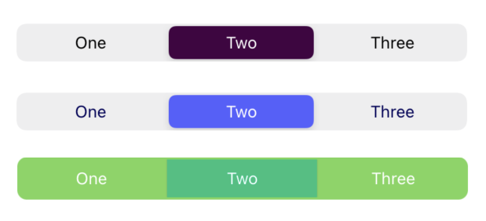

# CustomNativeElements
Customizable native iOS components that only require SwiftUI knowledge to be used.

## Description
🧑‍💻 **Ever wanted to customise your iOS native elements?**

In SwiftUI pickers, controls, sliders, switches, etc. are hard and laborious to customise. This library tries to make it easier thanks to *UIKit integration*, by making components that work just like standard SwiftUI components, but also allow a much easier and wider range of customisation.

For now includes: 
- Segmented Control

## Usage
These components have been studied to be used as similarly as possible as you would use the native SwiftUI ones. More detailed explanations follow.
### Segmented Control


1. Create an array of `String` representing the titles of your segments
2. Create a state variable to store the `selected` index.
3. The customizable options are: font (type and size) and colors (global background and text, selected segment background and text) 

**Note:** When changing the global background, the Segmented Control currently loses its default animation. There will be an attempt to solve this issue in the next update. Also *coming soon*, a way to change the font in the example program.

```swift
struct SwiftUIView: View {
    let pages = ["One", "Two", "Three"]
    @State var selected = 0
    
    var body: some View {
        NavigationView {
            VStack{
                CustomSegmentedControl(myItems: pages,
                                       selectedSegmentColor: UIColor.systemMint.cgColor,
                                       selectedSegmentTextColor: UIColor.white.cgColor,
                                       myFont: UIFont.boldSystemFont(ofSize: 15),
                                       selected: $selected)
                    .padding()
                switch selected {
                    case 0:
                        ViewZero()
                    case 1:
                        ViewOne()
                    case 2:
                        ViewTwo()
                    default:
                        Spacer()
                }
                Spacer()
            }
        }
        
    }
}    
```

**Required Parameters**

`myItems` - string array of the segment titles<br>
`selected` - binding to determine which segment is selected

**Available customizations - optional parameters**

`backgroundColor` - CGColor for the Segmented Control's background<br>
`textColor` - CGColor for the Segmented Control's text<br>
`selectedSegmentColor` - CGColor for the selected segment background<br>
`selectedSegmentTextColor` - CGColor for the selected segment text<br>
`myFont` - UIFont paramenter to change font family, size and weight 

## Example
To try out color commbinations with a visual interface, clone the repo `https://github.com/anthealb/CustomNativeElements.git` in your XCode and run it.

## Installation
To install `CustomNativeElements` manually, drop `CustomSegmentedControl.swift` in your project.

## Requirements
* iOS 13+
* Xcode 11+
